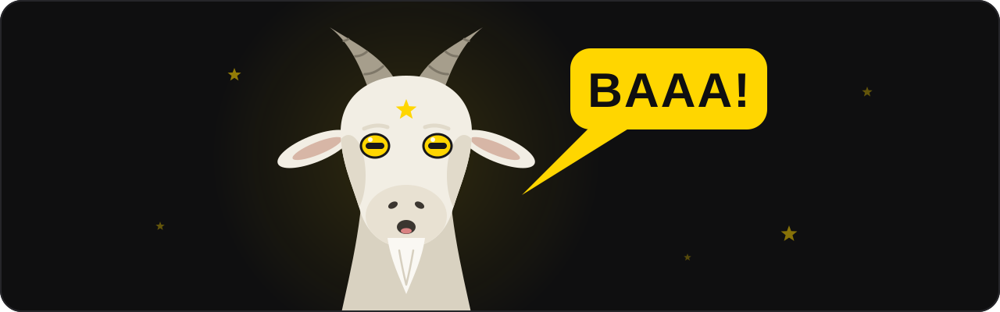

<p align="center">
  
</p>

# BAAA (Basic Asset Assistant AI)

A simple asset assistant for VRChat. It lives inside Unity, checks your outfit, fixes what's broken and helps you make it lighter.

BAAA was made to help find problems, and to help people who are new to uploading clothing. Open it from **BAAA > Open tool** in Unity's top menu.

## Install

BAAA is a VCC package. Open our [listing page](https://theamazingcobra.github.io/Basic-Asset-Assistant-Ai/) and press **Add to VCC**, or add this repository in VCC under Settings > Packages > Add Repository:

```
https://theamazingcobra.github.io/Basic-Asset-Assistant-Ai/index.json
```

Then add BAAA to your avatar project from Manage Project. VCC keeps it up to date.

Not using VCC? Every [release](https://github.com/TheAmazingCobra/Basic-Asset-Assistant-Ai/releases) also has a .unitypackage you can import.

## A hobby project

BAAA is a hobby project, not company software. Its code was written with the help of AI. A lot of people don't like that, and we respect it, so BAAA is never sent with packs.

## Why it's called BAAA

BAAA stands for Basic Asset Assistant AI. The AI in the name is there to be transparent that it was coded with the help of AI, specifically Claude Fable 5.1 MAX and Claude Opus 5.5 MAX.

AI only helped write the code. The tool itself doesn't use AI, doesn't record anything about you and never connects to the internet.

- Apart from the changes you make in your project, it only remembers your language and whether you accepted the advanced notice. Unity keeps both on your own computer.
- The Get VRCFury and Get Poiyomi buttons just open those download pages in your browser.

## Works with

Any VRCFury outfit you put on an avatar. A creator can also add a small file to BAAA's `Supported Creators` folder that says where their packs live. With it, BAAA lists their outfits before you place them, and texture quality covers the whole pack. The folder has a README on how to write one.

## What it does

| Tab | What it's for |
| --- | --- |
| Check | Finds what's broken and fixes it. Every fix is one Ctrl+Z. |
| Pieces | Take off the pieces you don't want. Click again to put them back. |
| Colors | Choose the color your outfit loads in and see it on your avatar. |
| Features | Turn off what you don't need, like color sliders, PhysBones, colliders and contacts. |
| Perf Scanner | What the outfit adds to your avatar, and your VRChat rank with and without it. |
| Performance | Texture sizes and compression, with their own rows for normal, roughness and metallic maps and menu icons. |
| VRCFury | Adds VRCFury's built-in optimizers to your avatar. |
| Fuser | Fuses the outfit into one mesh. Extreme also puts every texture on one atlas. |
| Quest | Makes a Quest copy and swaps it in. Your PC version stays the same. |
| Decimator | Fewer triangles, while toggles, color changers and pieces keep working. |

Every outfit in your scene gets a star in the Hierarchy. Green means all good. Red means something needs a look. Yellow means it's a Fused, Extreme, Quest or Decimated version. Click the star to open BAAA on that outfit.

## Advanced tabs

Fuser, Quest and Decimator stay grayed out until you accept a short notice, once per project. They work on a copy of your outfit and keep the original, so you can always go back.

To see the notice again, use **BAAA > Reset Pop-ups**.

## What you need

- Unity 2022.3, the version VRChat uses
- The VRChat Avatars SDK
- VRCFury, plus Poiyomi for outfits that use it

The Check tab tells you if something is missing.

## Languages

English, Português (Brasil), Español and 日本語. Pick one from the button at the top of the window. Each language is a plain text file in the `Languages` folder, so anyone can fix a line.

## Credits

The Decimator runs on [Meshia Mesh Simplification](https://github.com/RamType0/Meshia.MeshSimplification) by Ram.Type-0, taken from the [touma-tw fork](https://github.com/touma-tw/Meshia.MeshSimplification). When a project is missing the packages Meshia needs, it falls back to [UnityMeshSimplifier](https://github.com/Whinarn/UnityMeshSimplifier) by Mattias Edlund. Both are MIT licensed, and their full notices sit next to their code.

## License

[MIT](LICENSE). The bundled mesh engines keep their own MIT licenses.
